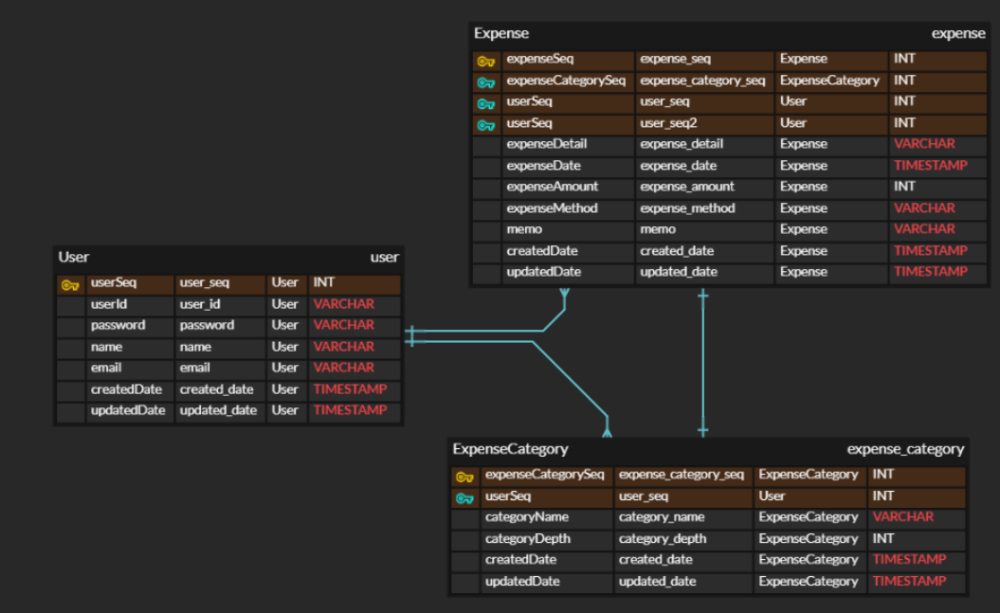

# 데이블 설계 (ERD)

- 계정
  - seq (pk)
  - 아이디
  - 비밀번호
  - 이름
  - 이메일
  - 생성 날짜 (메타정보)
  - 업데이트 날짜 (메타정보)

- 지출 내역 테이블
    - seq (pk)
    - 계정 (fk)
    - 지출 카테고리 (fk)
    - 지출 내역
    - 지출 날짜
    - 지출 금액
    - 지출 수단
    - 간단 메모
    - 생성 날짜 (메타정보)
    - 업데이트 날짜 (메타정보)

- 지출 카테고리 테이블
    - seq (pk)
    - 계정 (fk)
    - 카테고리 명
    - 카테고리 깊이
    - 생성 날짜 (메타정보)
    - 업데이트 날짜 (메타정보)

